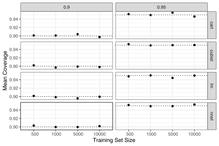
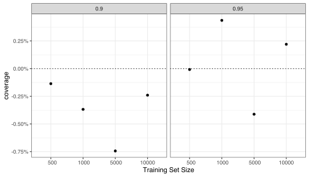
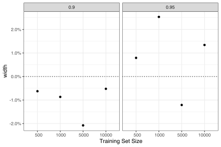

The `probably` package has several functions that can produce prediction intervals using conformal inference. This repo has some simulations to evaluate coverage properties for our implementations. 

The factors in the simulations

 - Confidence level: 90% and 95%.
 - Size of the training sets:    500,  1000,  5000, and 10000.
 - The type and amount of resampling (CV+ method only, see below). 
 - The model type: 
   - CART trees (default parameters),
   - Cubist rules (20 committees and 7 nearest neighbors), 
   - Linear regression via ordinary least squares and simple main effects, and 
   - Single layer, feed-forward neural networks (one properly tuned with 7 hidden units and another that deliberately overfits with 50 hidden units). Both were trained for 100 epochs. 

Each combination of settings was repeated 25 times. The "mean coverage" statistics shown below are the averages of 25 coverage statistics (each of which is based on 1,000 samples).

The data were simulated using the method detailed in Hooker (2004) and Sorokina _et al._ (2008) with a prediction function of 

Predictors 1, 2, 3, 6, 7, and 9 are standard uniform while the others are uniform on `[0.6, 1.0]`. The errors are normal with mean zero and default standard deviation of 0.25. Note that this method simulates a constant error term (e.g., homoscedasticity), which will come into play when quantile regression is used. 

The coverage properties were assessed using a test set of 1,000 simulated data points.

Split size was held constant at 500 samples for the two split methods discussed below. 

Each section below evaluated the coverage properties for each conformal method.

## Split Conformal

The coverage results from using `int_conformal_split()` where: 

We can also compare the conformal intervals for those produced naturally when ordinary least squares (OLS) is used to fit the model (with the usual normality assumptions on the residuals). We can assess both the difference in coverage and interval width. The simple differences in coverage were: 

While the coverage for 90% intervals was lower for this conformal method, the scale of the y-axis indicates that it is a meager difference.

The percent differences in the widths of the intervals were:

We might expect the parametric intervals for be more narrow. The 90% intervals show the opposite but this is a 2% difference (at most). 

## Split Quantile Conformal

Quantile random forests were used as the quantile regression method. 

Comparing these results to the OLS intervals: 

## CV+

For cross-validation, the simulations focused on V-fold cross-validation with V = 10. 

These results show TODO when compared with the OLS intervals: 

The methodology has only been derived for simple cross-validation. How does it work when other methods are used? For example, we could also use repeated 10-fold cross-validation as well as another method such as the bootstrap. 

For repeated cross-validation, 

If the bootstrap is used to resample the model, using varying amounts of resamples, there results are: 

## References

